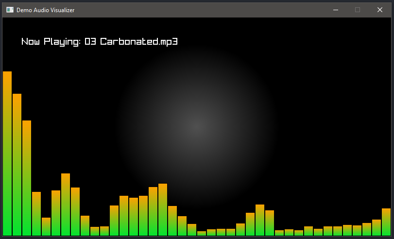

# demo_audio_visualizer
Simple audio visualizer in Go



Used libraries: 
- [raylib-go](https://github.com/gen2brain/raylib-go)
- [go-mp3](https://github.com/hajimehoshi/go-mp3)
- [oto](https://github.com/hajimehoshi/oto)
- [go-dsp](https://github.com/mjibson/go-dsp)


To disable the additional console window on Windows OS compile using:
```
go build -ldflags "-H=windowsgui -w -s"
```